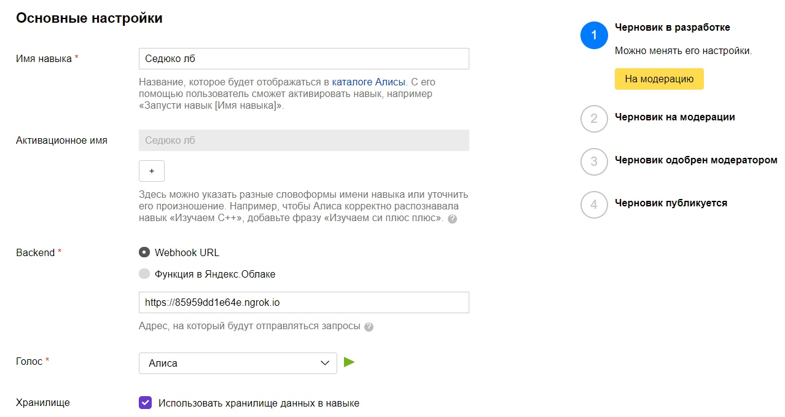
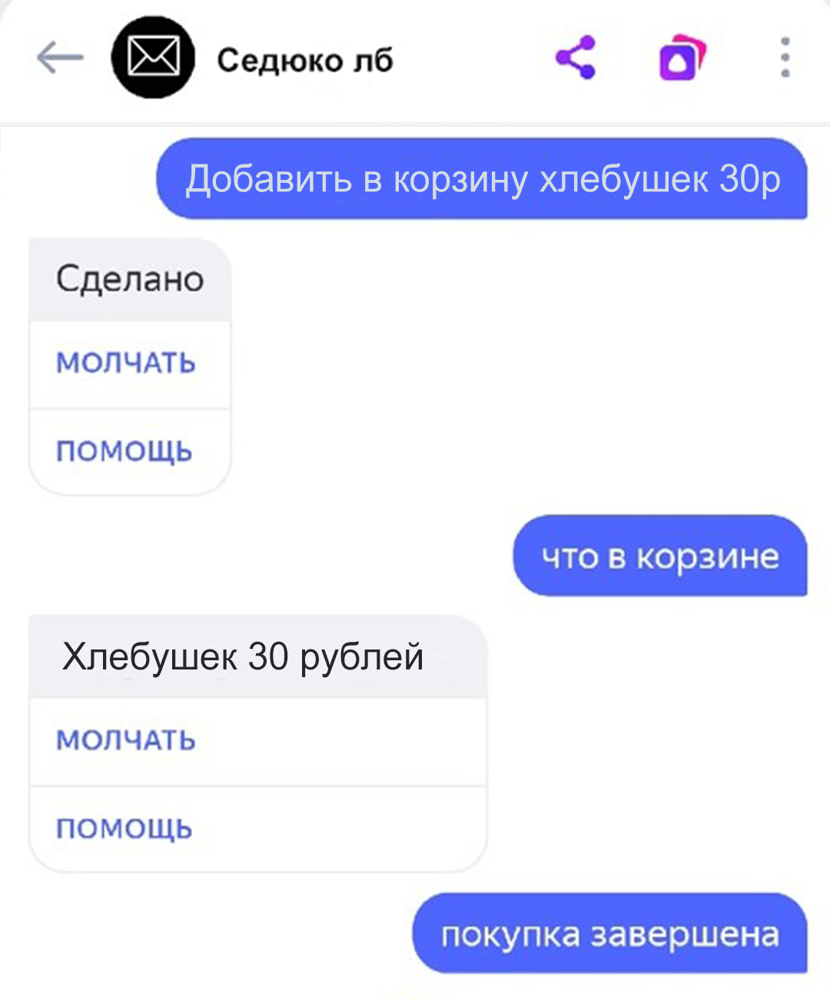
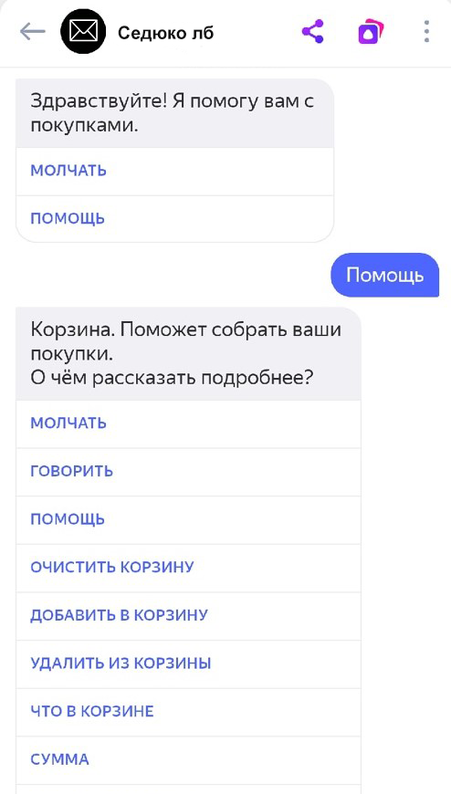
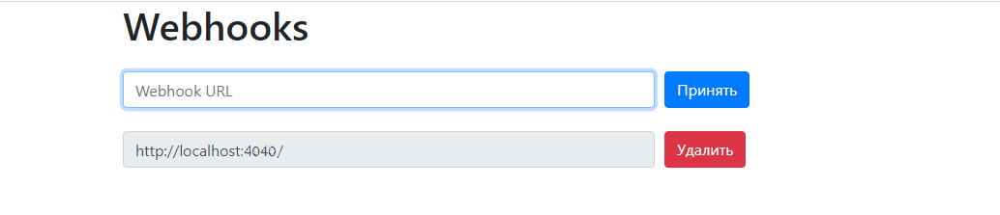

<p align="center">МИНИСТЕРСТВО НАУКИ  И ВЫСШЕГО ОБРАЗОВАНИЯ РОССИЙСКОЙ ФЕДЕРАЦИИ<br>
Федеральное государственное автономное образовательное учреждение высшего образования<br>
"КРЫМСКИЙ ФЕДЕРАЛЬНЫЙ УНИВЕРСИТЕТ им. В. И. ВЕРНАДСКОГО"<br>
ФИЗИКО-ТЕХНИЧЕСКИЙ ИНСТИТУТ<br>
Кафедра компьютерной инженерии и моделирования</p>
<br>
<h3 align="center">Отчёт по лабораторной работе № 1<br> по дисциплине "Программирование"</h3>
<br><br>
<p>студента 1 курса группы ИВТ-б-о-202(1)<br>
Седюко Дмитрий Витальевич<br>
направления подготовки 09.03.01 "Информатика вычесительна техника"</p>
<br><br>
<table>
<tr><td>Научный руководитель<br> старший преподаватель кафедры<br> компьютерной инженерии и моделирования</td>
<td>(оценка)</td>
<td>Чабанов В.В.</td>
</tr>
</table>
<br><br>
<p align="center">Симферополь, 2020</p>
<hr>


## Цель работы:

1. Получить представления о структуре post-запроса;
2. Изучить webhooks как метод взаимодействия web-приложений;

## Постановка задачи

1. Разработайте и зарегистрируйте навык для Алисы на сервисе Яндекс Диалоги;
2. В качестве backend-a для навыка реализуйте приложение на языке С++ выполняющее следующие функции:

Составление продуктовой корзины:
* Добавление продукта в корзину;
* Удаление продукта из корзины;
* Очистка корзины;
* Вывод списка товаров в корзине;
* Подсчёт стоимости товаров в корзине.
3. Вывод справочной информации по навыку;

4. Регистрацию webhook-ов сторонних сервисов;

5. Отправку данных на сторонние сервисы.

6. В качестве стороннего сервиса реализуйте приложение на языке Python выполняющее следующие функции:

* Ожидание данных о покупке;
* Сохранение поступивших данных в excel-документ.

## Выполнение работы

1. В сервисе Яндекс создать навык. Перешел в настройки навыка, настроил и активировал WebHook URL для бэкэнда, затем сохранил. (Рис. 1)

<p align="center">  </p>

<p align="center">Рис. 1 - Настройка навыка <br>

2. Команда "Очистить корзину" удаляет все данные о покупках, команда "Добавить в корзину" добавляет в корзину товар и цену, команда "Удалить из корзины" удаляет элемент, "Что в корзине" показывает, что в корзине, "Сумма" подсчитывает суммарную стоимость всех товаров. (Рис. 2). Команда "помощь" включает режим помощи. (Рис. 3)

<p align="center">  </p>

<p align="center">Рис. 2 - Функционал корзины<br>

<p align="center">  </p>

<p align="center">Рис. 3 - Функционал помощи<br>

3. Для взаимодействия с подчинёнными сервисами использовал Webhook. html-шаблон отвечает за добавление и удаление Webhook-ов. (Рис. 4)

<p align="center">  </p>

<p align="center">Рис. 4 - Webhook<br>

4. Код сервера на С++:

```C++
#include <iostream>
#include <vector>
#include <cpp_httplib/httplib.h>
#include <nlohmann/json.hpp>
#include"webhook.h"
#include <iomanip>
using json = nlohmann::json;
using namespace httplib;
using std::string;
using namespace std;

class dialog{
public:
	string Get_Response_Main(string body, json j, json _json, json param);
	string Get_Response_Help(string body, json j, json _json, json param, bool start = false);
	string _word(json _json, int id);
	string Get_Words(json _json, int beginid, int endid);
	string Get_Response(string body);
	string Basket(json param);
	string sum_Basket(json param);
	string Response(string new_j, json param, json buttons, bool end_session = false);

	json Buttons_Main(json param);
	json Buttons_Help(json param);

	void EraseFromCart(json& param, string name);
	dialog();
};

string dialog::Response(string new_j, json param, json buttons, bool end_session) {
	json j;
	j["response"]["text"] = new_j;
	if (param["canSpeak"])
		j["response"]["tts"] = new_j;

	j["response"]["buttons"] = buttons;
	j["response"]["end_session"] = end_session;
	j["version"] = "1.0";
	j["session_state"] = param;
	stringstream new_j2;
	new_j2 << setw(2) << j << endl;
	return new_j2.str();
}

string dialog::_word(json _json, int id) {
	if (id < _json.size()) {
		string new_j = _json[id];
		return new_j;
	}
	return "";
}

string dialog::Get_Words(json _json, int stid, int endid) {
	string rez = "";
	for (int i = stid; i <= endid; i++) {
		rez += _word(_json, i);
		if (i != endid) rez += " ";
	}
	return rez;
}

string dialog::Basket(json param) {
	if (param["check"].size() <= 0) {
		return u8"В корзине только пустота...";
	}
	string rez = "";
	for (int i = 0; i < param["check"].size(); i++) {
		string name = param["check"][i]["item"];
		int price = param["check"][i]["price"];
		string temp;
		temp = name + u8" " + to_string(price);
		temp = temp + u8" тугриков\n";
		rez += temp;
	}
	rez.pop_back();
	return rez;
}

string dialog::sum_Basket(json param) {
	int total = 0;
	for (int i = 0; i < param["check"].size(); i++) {
		total += param["check"][i]["price"];
	}
	return u8"Суммарная стоимость: " + std::to_string(total) + u8" тугриков";
}

string dialog::Get_Response_Main(string body, json j, json _json, json param) {
	if (j["session"]["new"]) {
		param["canSpeak"] = true;
		param["check"] = {};
		param["mode"] = "main";
	}

	string rez = "";
	json buttons = Buttons_Main(param);

	if (j["session"]["new"]) {
		rez = u8"Здравствуйте! Я помогу вам с покупками.";
		return Response(rez, param, buttons);
	}
	else if (_word(_json, 0) == u8"говорить") {
		param["canSpeak"] = true;
		json buttons = Buttons_Main(param);
		rez = u8"Говорю-говорю";
		return Response(rez, param, buttons);
	}
	else if (_word(_json, 0) == u8"молчать") {
		param["canSpeak"] = false;
		json buttons = Buttons_Main(param);
		rez = u8"Молчу-молчу";
		return Response(rez, param, buttons);
	}
	else if (_word(_json, 0) == u8"помощь") {
		param["mode"] = u8"help";
		return Get_Response_Help(body, j, _json, param, true);
	}
	else if (Get_Words(_json, 0, 2) == u8"добавить в корзину") {
		string name = _word(_json, 3);
		int price = std::stoi(_word(_json, 4));
		param["check"].push_back({ {"item", name}, {"price", price} });
		rez = u8"Сделано";
		return Response(rez, param, buttons);
	}
	else if (Get_Words(_json, 0, 2) == u8"удалить из корзины") {
		string name = _word(_json, 3);
		EraseFromCart(param, name);
		rez = u8"Как скажешь";
		return Response(rez, param, buttons);
	}
	else if (Get_Words(_json, 0, 1) == u8"очистить корзину") {
		param["check"] = {};
		rez = u8"Корзина пуста";
		return Response(rez, param, buttons);
	}
	else if (Get_Words(_json, 0, 2) == u8"что в корзине") {
		rez = Basket(param);
		return Response(rez, param, buttons);
	}
	else if (_word(_json, 0) == u8"сумма") {
		rez = sum_Basket(param);
		return Response(rez, param, buttons);
	}
	else if (Get_Words(_json, 0, 1) == u8"покупка завершена") {
		webH.Send(param["check"], j["session"]["user"]["user_id"]);
		return Response(u8"Заходите еще", param, buttons, true);
	}
	else {
		rez = u8"Я вас не понимаю";
		return Response(rez, param, buttons);
	}
}

string dialog::Get_Response_Help(string body, json j, json _json, json param, bool start) {
	string rez;
	json buttons = Buttons_Help(param);
	if (start) {
		rez = u8"Корзина. Поможет собрать ваши покупки.\nО чём рассказать подробнее?";
		return Response(rez, param, buttons);
	}
	if (_word(_json, 0) == u8"молчать") {
		rez = u8"Я перестану озвучивать сообщения до конца сессии или ввода команды ::говорить::.\nО чём ещё рассказать?";
		return Response(rez, param, buttons);
	}
	else if (_word(_json, 0) == u8"говорить") {
		rez = u8"Я начну озвучивать сообщения до конца сессии или ввода команды ::молчать::.\nО чём ещё рассказать?";
		return Response(rez, param, buttons);
	}
	else if (_word(_json, 0) == u8"помощь") {
		rez = u8"Переключение в режим помощь, в этом режиме я могу рассказать о всех функциях.\nО чём ещё рассказать?";
		return Response(rez, param, buttons);
	}
	else if (Get_Words(_json, 0, 1) == u8"очистить корзину")
	{
		rez = u8"Полная очистка корзины, все элементы будут удалены из корзины.\nО чём ещё рассказать?";
		return Response(rez, param, buttons);
	}
	else if (Get_Words(_json, 0, 2) == u8"добавить в корзину") {
		rez = u8"ДОБАВИТЬ В КОРЗИНУ + название товара + цена товара\nВ корзину добавляется товар, название и цену которого вы ввели.\nО чём ещё рассказать?";
		return Response(rez, param, buttons);
	}
	else if (Get_Words(_json, 0, 2) == u8"удалить из корзины") {
		rez = u8"УДАЛИТЬ ИЗ КОРЗИНЫ + название\nБезвозвратно удаляет товар с таким названием из корзины.\nО чём ещё рассказать?";
		return Response(rez, param, buttons);
	}
	else if (Get_Words(_json, 0, 2) == u8"что в корзине") {
		rez = u8"Информация о том что на момент ввода команды находится в корзине: Название и цена.\nО чём ещё рассказать?";
		return Response(rez, param, buttons);
	}
	else if (_word(_json, 0) == u8"сумма") {
		rez = u8"Сообщает суммарную стоимость товаров в корзине.\nО чём ещё рассказать?";
		return Response(rez, param, buttons);
	}
	else if (Get_Words(_json, 0, 1) == u8"покупка завершена") {
		rez = u8"Завершает сессию покупок и отправляет ваши покупкт на оформление....\nО чём ещё рассказать?";
		return Response(rez, param, buttons);
	}
	else if (Get_Words(_json, 0, 2) == u8"выход из помощи") {
		param["mode"] = u8"main";
		rez = u8"Обращайся ещё";
		return Response(rez, param, Buttons_Main(param));
	}
	else {
		rez = u8"Я не понимаю тебя...";
		return Response(rez, param, buttons);
	}
}

string dialog::Get_Response(string body) {
	json j = json::parse(body);
	json _json = j["request"]["nlu"]["tokens"];
	json state = j["state"]["session"];
	string mode;

	try {
		mode = state["mode"];
	}
	catch (...) {
		mode = u8"main";
	}

	if (mode == u8"main") {
		return Get_Response_Main(body, j, _json, state);
	}
	if (mode == u8"help") {
		return Get_Response_Help(body, j, _json, state);
	}
}


json dialog::Buttons_Main(json param) {
	json buttons = json::array();
	if (param["canSpeak"]) {
		buttons[0]["title"] = u8"Молчать";
	}
	else {
		buttons[0]["title"] = u8"Говорить";
	}
	buttons[1]["title"] = u8"Помощь";
	return buttons;
}

json dialog::Buttons_Help(json param) {
	json buttons = json::array();
	buttons[0]["title"] = u8"Молчать"; buttons[1]["title"] = u8"Говорить"; buttons[2]["title"] = u8"Помощь"; buttons[3]["title"] = u8"Очистить корзину";
	buttons[4]["title"] = u8"Добавить в корзину"; buttons[5]["title"] = u8"Удалить из корзины"; buttons[6]["title"] = u8"Что в корзине"; buttons[7]["title"] = u8"Сумма";
	buttons[8]["title"] = u8"Покупка завершена"; buttons[9]["title"] = u8"Выход из помощи";
	return buttons;
}

void dialog::EraseFromCart(json& param, string name) {
	for (int i = 0; i < param["check"].size(); i++) {
		if (param["check"][i]["item"] == name) {
			param["check"].erase(i);
			return;
		}
	}
}

dialog::dialog() {}
dialog;

string replace_str(string str, string source, string nw) {
	SIZE_T beg = str.find(source);
	return str.replace(beg, source.length(), nw);
}

string readFile(string filename) {
	ifstream is(filename);
	stringstream ss;
	ss << is.rdbuf();
	return ss.str();
}

void process_post(const Request& req, Response& res) {
	if (req.method != "POST")
		return;

	if (req.has_param("del")) {
		string val = req.get_param_value("del");
		int id = webH.poisk(val);
		if (id >= 0)
			webH.Clear(id);
	}
	if (req.has_param("set")) {
		string val = req.get_param_value("set");
		webH.Push(val);
	}
	res.set_redirect("#");
}

void response(const Request& req, Response& res) {
	string list_original = readFile("list.html");
	string list = "";
	for (int i = 0; i < webH.h(); i++) {
		string list_temp = list_original;
		list_temp = replace_str(list_temp, "Webhook URL", webH.Get(i));
		list_temp = replace_str(list_temp, "Webhook URL", webH.Get(i));
		list += list_temp + "\n";
	}
	string templ = readFile("template.html");
	templ = replace_str(templ, "{webhooks_list}", list);
	process_post(req, res);
	res.set_content(templ, "text/html");
}

void talk_response(const Request& req, Response& res) {
	string body = req.body.c_str();
	string aresp = Alice.Get_Response(body);
	res.set_content(aresp, "text/plain");
}

int main()
{
	Server svr;
	svr.Post("/", talk_response);
	svr.Get("/webhooks", response);
	svr.Post("/webhooks", response);
	std::cout << "Start server... OK\n";
	svr.listen("127.0.0.1", 1234);
}
```
5. Код клиентского прилоения на Python:

```Python
from flask import Flask, request, jsonify
from datetime import datetime
import openpyxl
from openpyxl.styles import Alignment, PatternFill, Font, Border, Side

i = 1
arr = []


def Table(sheet):
    sheet.column_dimensions['A'].width = 15;
    sheet['A1'] = "№"
    sheet.column_dimensions['B'].width = 50;
    sheet['B1'] = "ID"
    sheet.column_dimensions['C'].width = 30;
    sheet['C1'] = "время.дата покупки"
    sheet.column_dimensions['D'].width = 60;
    sheet['D1'] = "Заказ"
    sheet.column_dimensions['E'].width = 20;
    sheet['E1'] = "Цена заказа\n(рублей)"


def Style(sheet, j, x):
    Tst = Border(top=Side(style='thin'), bottom=Side(style='thin'))
    for ij in range(1, j):
        for ix in range(0, x):
            sheet[ij][ix].border = Tst
            sheet[ij][ix].alignment = Alignment(horizontal='center', vertical='center')
    return sheet


def prID(sheet, j):
    i = j - 1
    while (i > 1) and (sheet[i][0].value is None):
        i = i - 1
    if i <= 1:
        return 1
    else:
        return sheet[i][0].value + 1


def Json(sheet):
    j = getId(sheet)
    for i in range(len(arr)):
        sheet[j][0].value = 1 if j <= 1 else prID(sheet, j)
        sheet[j][1].value = arr[i]["user_id"]
        sheet[j][2].value = arr[i]["datetime"]
        firstr = j
        for item in arr[i]["check"]:
            sheet[j][3].value = item["item"]
            sheet[j][4].value = item["price"]
            j = j + 1
        sheet.merge_cells(start_row=firstr, start_column=1, end_row=j - 1, end_column=1)
        sheet.merge_cells(start_row=firstr, start_column=2, end_row=j - 1, end_column=2)
        sheet.merge_cells(start_row=firstr, start_column=3, end_row=j - 1, end_column=3)
    sheet = Style(sheet, j, 5)
    return sheet


def save():
    global arr
    try:
        book = openpyxl.open("data.xlsx", read_only=False)
    except:
        book = openpyxl.Workbook()
    sheet = book.active
    if sheet['A1'].value is None:
        sheet = Table(sheet)
    sheet = Json(sheet)
    book.save("data.xlsx")


def Datatime(content):
    global arr
    arr.append(content);
    arr[-1]["datetime"] = datetime.now().strftime("%d/%m/%Y %H:%M:%S")
    if len(arr) >= i:
        save()
        arr = []


def getId(sheet):
    i = 1
    while not (sheet[i][3].value is None):
        i = i + 1
    return i


app = Flask(__name__)


@app.route('/', methods=['POST', 'GET'])
def index():
    if request.is_json:
        content = request.get_json()
        Datatime(content)
        return 'OK'


app.run()
```
## Вывод:

Создал серверное приложение на С++ и клиентское приложение на Python.Реализовано приложение, составляющее список продуктов и подсчитывающее общую стоимость покупки.
Для серверного приложения на С++ использовал библиотеки json и cpp-httplib, а для клиентского на python использовал библиотеку flask.
