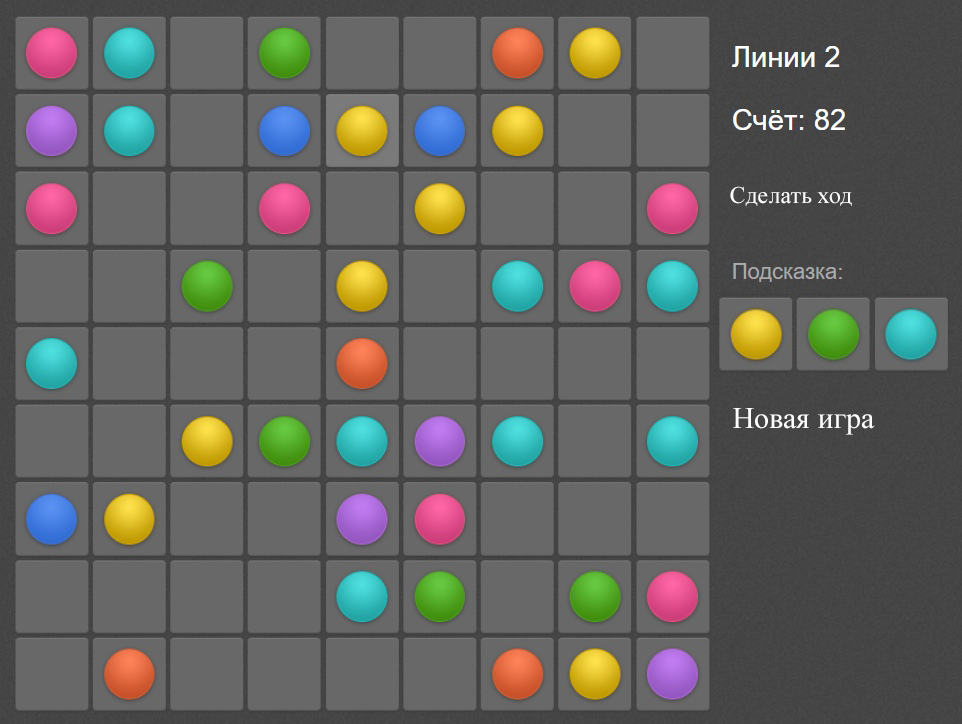

<p align="center">МИНИСТЕРСТВО НАУКИ  И ВЫСШЕГО ОБРАЗОВАНИЯ РОССИЙСКОЙ ФЕДЕРАЦИИ<br>
Федеральное государственное автономное образовательное учреждение высшего образования<br>
"КРЫМСКИЙ ФЕДЕРАЛЬНЫЙ УНИВЕРСИТЕТ им. В. И. ВЕРНАДСКОГО"<br>
ФИЗИКО-ТЕХНИЧЕСКИЙ ИНСТИТУТ<br>
Кафедра компьютерной инженерии и моделирования</p>
<br>
<h3 align="center">Отчёт по лабораторной работе № 1<br> по дисциплине "Программирование"</h3>
<br><br>
<p>студента 1 курса группы ИВТ-б-о-202(1)<br>
Седюко Дмитрий Витальевич<br>
направления подготовки 09.03.01 "Информатика вычесительна техника"</p>
<br><br>
<table>
<tr><td>Научный руководитель<br> старший преподаватель кафедры<br> компьютерной инженерии и моделирования</td>
<td>(оценка)</td>
<td>Чабанов В.В.</td>
</tr>
</table>
<br><br>
<p align="center">Симферополь, 2020</p>
<hr>

## Цель работы

Научится создавать графические приложения с использованием библиотеки TKinter, а также погрузится в разработку игровой логики с использованием ООП методологии.

## Постановка задачи

Используя стандартный модуль для разработки программ с графическим интерфейсом Tkinter реализуйте игру Lines на зыке Python.
В качестве образца графического интерфейса используйте [данную игру](http://game-shariki.ru/linii-2).

## Выполнение работы

1. Изучил библиотеку Tkinter. Затем были написаны функции:
* Поля ячеек
* Расположения шариков в ячейках
* Перемещения шариков(запоминание нажатой ячейки, и цвета шарика в ней)
* Проверка линий(горизонтальных, вертикальних, диагональных)
* Очищение линий с шариками одинкаового цвета
* Поиск пути перемещения шарика
* Подсчет "игровых очков"

```Python
from tkinter import *
from PIL import Image, ImageTk
import random
import os
import sys
import numpy as np


class Game:
    def __init__(self):
        self.used = {}
        self.loool = False
        self.use = [100]
        self.root = Tk()
        self.podskazka = []
        self.Hasrowcolleced = [["", 0]]
        self.canbevisited = []
        self.root.title("Game lines")
        self.root.geometry("900x640")
        self.root.configure(background="#414141")
        self.col = 0
        self.localgem = []
        self.tileset = Image.open("image/cell.png").convert("RGBA")
        self.img_tile = ImageTk.PhotoImage(self.tileset.crop((0, 1, 67, 66)))
        self.tile_selected = (
            Image.open("image/cell.png").convert("RGBA").crop((1, 69, 67, 135))
        )
        self.img_tile_selected = ImageTk.PhotoImage(self.tileset.crop((1, 69, 67, 135)))
        self.page = Image.open("image/page.png").convert("RGBA")
        self.img_page = ImageTk.PhotoImage(self.page)
        self.colorpic = []
        self.clic = False
        self.selected_circle = 0
        b = (0, 0, 52, 52)
        zoom = (63, 62)
        self.numberfortable = {}
        self.clcked = 0
        self.clckedcolor = 0
        self.row = []
        self.foundrow = False
        self.tabel = []
        self.num = []
        self.clicto = 0
        self.placed = False
        self.rand1, self.rand2, self.rand3 = (
            random.randint(0, 6),
            random.randint(0, 6),
            random.randint(0, 6),
        )
        self.balraw = {
            "pink": Image.open("image/pink.png")
            .convert("RGBA")
            .crop(b)
            .resize(zoom),
            "orange": Image.open("image/orange.png")
            .convert("RGBA")
            .crop(b)
            .resize(zoom),
            "yellow": Image.open("image/yellow.png")
            .convert("RGBA")
            .crop(b)
            .resize(zoom),
            "green": Image.open("image/green.png")
            .convert("RGBA")
            .crop(b)
            .resize(zoom),
            "aqua": Image.open("image/aqua.png")
            .convert("RGBA")
            .crop(b)
            .resize(zoom),
            "blue": Image.open("image/blue.png")
            .convert("RGBA")
            .crop(b)
            .resize(zoom),
            "violet": Image.open("image/violet.png")
            .convert("RGBA")
            .crop(b)
            .resize(zoom),
            "bg": Image.open("image/cell.png").convert("RGBA"),
        }
        pic_size_same_as_bgr = Image.new("RGBA", self.tileset.size)
        pic_size_same_as_bgr.paste(self.balraw["pink"], (70, 0))
        pic_size_same_as_bgr_sel = Image.new("RGBA", self.tile_selected.size)
        pic_size_same_as_bgr_sel.paste(self.balraw["pink"], (70, 0))

        pp = [
            Image.alpha_composite(self.tileset, pic_size_same_as_bgr),
            Image.alpha_composite(self.tileset, pic_size_same_as_bgr),
            Image.alpha_composite(self.tileset, pic_size_same_as_bgr),
            Image.alpha_composite(self.tileset, pic_size_same_as_bgr),
            Image.alpha_composite(self.tileset, pic_size_same_as_bgr),
            Image.alpha_composite(self.tileset, pic_size_same_as_bgr),
            Image.alpha_composite(self.tileset, pic_size_same_as_bgr),
        ]
        ppchek = [
            Image.alpha_composite(self.tile_selected, pic_size_same_as_bgr_sel),
            Image.alpha_composite(self.tile_selected, pic_size_same_as_bgr_sel),
            Image.alpha_composite(self.tile_selected, pic_size_same_as_bgr_sel),
            Image.alpha_composite(self.tile_selected, pic_size_same_as_bgr_sel),
            Image.alpha_composite(self.tile_selected, pic_size_same_as_bgr_sel),
            Image.alpha_composite(self.tile_selected, pic_size_same_as_bgr_sel),
            Image.alpha_composite(self.tile_selected, pic_size_same_as_bgr_sel),
        ]
        pp[0].paste(self.balraw["pink"], (0, 0), self.balraw["pink"])
        pink = ImageTk.PhotoImage(pp[0].crop((1, 0, 67, 66)))

        pp[1].paste(self.balraw["orange"], (0, 0), self.balraw["orange"])
        red = ImageTk.PhotoImage(pp[1].crop((1, 0, 67, 66)))

        pp[2].paste(self.balraw["yellow"], (0, 0), self.balraw["yellow"])
        yellow = ImageTk.PhotoImage(pp[2].crop((1, 0, 67, 66)))

        pp[3].paste(self.balraw["green"], (0, 0), self.balraw["green"])
        green = ImageTk.PhotoImage(pp[3].crop((1, 0, 67, 66)))

        pp[4].paste(self.balraw["aqua"], (0, 0), self.balraw["aqua"])
        aqua = ImageTk.PhotoImage(pp[4].crop((1, 0, 67, 66)))

        pp[5].paste(self.balraw["blue"], (0, 0), self.balraw["blue"])
        blue = ImageTk.PhotoImage(pp[5].crop((1, 0, 67, 66)))

        pp[6].paste(self.balraw["violet"], (0, 0), self.balraw["violet"])
        violet = ImageTk.PhotoImage(pp[6].crop((1, 0, 67, 66)))

        # ckecked
        ppchek[0].paste(self.balraw["pink"], (0, 0), self.balraw["pink"])
        pink1 = ImageTk.PhotoImage(ppchek[0].crop((1, 0, 66, 66)))

        ppchek[1].paste(self.balraw["orange"], (0, 0), self.balraw["orange"])
        red1 = ImageTk.PhotoImage(ppchek[1].crop((1, 0, 66, 66)))

        ppchek[2].paste(self.balraw["yellow"], (0, 0), self.balraw["yellow"])
        yellow1 = ImageTk.PhotoImage(ppchek[2].crop((1, 0, 66, 66)))

        ppchek[3].paste(self.balraw["green"], (0, 0), self.balraw["green"])
        green1 = ImageTk.PhotoImage(ppchek[3].crop((1, 0, 66, 66)))

        ppchek[4].paste(self.balraw["aqua"], (0, 0), self.balraw["aqua"])
        aqua1 = ImageTk.PhotoImage(ppchek[4].crop((1, 0, 66, 66)))

        ppchek[5].paste(self.balraw["blue"], (0, 0), self.balraw["blue"])
        blue1 = ImageTk.PhotoImage(ppchek[5].crop((1, 0, 66, 66)))

        ppchek[6].paste(self.balraw["violet"], (0, 0), self.balraw["violet"])
        violet1 = ImageTk.PhotoImage(ppchek[6].crop((1, 0, 66, 66)))
        self.page = Image.open("image/page.png").convert("RGBA")
        self.img_page = ImageTk.PhotoImage(self.page)
        self._balls = {
            "pink": pink,
            "orange": orange,
            "yellow": yellow,
            "green": green,
            "aqua": aqua,
            "blue": blue,
            "violet": violet,
        }
        self._ballsselected = {
            "pink": pink1,
            "orange": orange1,
            "yellow": yellow1,
            "green": green1,
            "aqua": aqua1,
            "blue": blue1,
            "violet": violet1,
        }
        # self.smallballs = {
        #    "pink": pink2,
        #    "red": red2,
        #    "yellow": yellow2,
        #    "green": green2,
        #    "aqua": aqua2,
        #    "blue": blue2,
        #    "violet": violet2
        # }
        self.colors = {
            0: "pink",
            1: "orange",
            2: "yellow",
            3: "green",
            4: "aqua",
            5: "blue",
            6: "violet",
        }
        self.colors_in_num = {
            "pink": 1,
            "orange": 2,
            "yellow": 3,
            "green": 4,
            "aqua": 5,
            "blue": 6,
            "violet": 7,
        }

    def setperdcolor(self):
        self.rand1, self.rand2, self.rand3 = (
            random.randint(0, 6),
            random.randint(0, 6),
            random.randint(0, 6),
        )
        self.podskazka[0].config(image=self._balls[self.colors[self.rand1]])
        self.podskazka[1].config(image=self._balls[self.colors[self.rand2]])
        self.podskazka[2].config(image=self._balls[self.colors[self.rand3]])

    def restore(self):
        for i in self.localgem:
            if i not in self.used:
                i.config(image=self.img_tile)

    def restorecolor(self):
        self.restore()
        for i in self.localgem:
            if i in self.used:
                self.localgem[self.localgem.index(i)].config(
                    image=self._balls[self.used[i][0]]
                )

    def creattabel(self):
        j = 0
        for i in self.localgem:
            j += 1
            if i in self.used:
                self.row.append([i, self.colors_in_num[self.used[i][0]]])
            else:
                self.row.append([i, 0])
            if j % 9 == 0:
                self.tabel.append(self.row.copy())
                self.row.clear()

    def checkforrow(self):
        self.Hasrowcolleced = [["", 0]]
        for j in self.tabel:
            for i in j:
                if i[1] == self.Hasrowcolleced[0][1] and i[1] != 0:
                    self.Hasrowcolleced.append([i[0], i[1]])
                else:
                    if len(self.Hasrowcolleced) >= 5:
                        self.foundrow = True
                        self.col += len(self.Hasrowcolleced) * 2
                        # self.Hasrowcolleced.clear()
                        # self.Hasrowcolleced.append(['', 0])
                        return
                    self.Hasrowcolleced.clear()
                    self.Hasrowcolleced.append([i[0], i[1]])

    def chackdiags(self):
        npar = np.array(self.tabel)
        diags = [npar[::-1, :].diagonal(i) for i in range(-8, 9)]
        diags.extend(npar.diagonal(i) for i in range(8, -9, -1))
        na = list(diags)
        for i in na:
            if len(i[1]) >= 5:
                num = 0
                for j in i[1]:
                    num += 1
                    if j == self.Hasrowcolleced[0][1] and j != 0:
                        self.Hasrowcolleced.append([i[0][num - 1], j])
                    else:
                        if len(self.Hasrowcolleced) >= 5:
                            self.foundrow = True
                            self.col += len(self.Hasrowcolleced) * 2
                            return 0
                        self.Hasrowcolleced.clear()
                        self.Hasrowcolleced.append([i[0][num - 1], j])

    def checkforcol(self):
        a = np.array(self.tabel)
        b = [[row[i] for row in a] for i in range(9)]
        for j in b:
            for i in j:
                if i[1] == self.Hasrowcolleced[0][1] and i[1] != 0:
                    self.Hasrowcolleced.append([i[0], i[1]])
                else:
                    if len(self.Hasrowcolleced) >= 5:
                        self.foundrow = True
                        self.col += len(self.Hasrowcolleced) * 2
                        return
                    self.Hasrowcolleced.clear()
                    self.Hasrowcolleced.append([i[0], i[1]])

    def AddScore(self):
        score.config(text=self.col)

    def isPath(self, matrix, n=9):
        visited = [[False for x in range(n)] for y in range(n)]
        flag = False
        for i in range(n):
            for j in range(n):
                if matrix[i][j] == 1 and not visited[i][j]:
                    if self.checkPath(matrix, i, j, visited):
                        flag = True
                        break
        if flag:
            return True
        else:
            return False

    def isSafe(self, i, j, matrix):
        if i >= 0 and i < len(matrix) and j >= 0 and j < len(matrix[0]):
            return True
        return False

    def checkPath(self, matrix, i, j, visited):
        if self.isSafe(i, j, matrix) and matrix[i][j] != 0 and not visited[i][j]:
            visited[i][j] = True
            if matrix[i][j] == 2:
                return True
            up = self.checkPath(matrix, i - 1, j, visited)
            if up:
                return True
            left = self.checkPath(matrix, i, j - 1, visited)
            if left:
                return True
            down = self.checkPath(matrix, i + 1, j, visited)
            if down:
                return True
            right = self.checkPath(matrix, i, j + 1, visited)
            if right:
                return True
        return False

    def HasAccess(self):
        mat1 = []
        a = 3
        for i in range(9):
            row1 = []
            for j in range(9):
                a = self.tabel[i][j][0]
                if self.tabel[i][j][1] == 0:
                    a = 3
                    if self.tabel[i][j][0] == self.clicto:
                        a = 2
                    row1.append(a)
                elif self.tabel[i][j][0] == self.clcked:
                    row1.append(1)
                else:
                    row1.append(0)
            mat1.append(row1)
        if self.isPath(mat1):
            return True
        else:
            return False

    def click(self, event):
        if event.widget in self.used:
            self.clckedcolor = self.used[event.widget][0]
            self.clcked = event.widget
            self.restorecolor()
            self.clcked.config(image=self._ballsselected[self.clckedcolor])
            self.selected_circle = self.used[event.widget][1]
            self.clic = True
        elif self.clic == True and event.widget != self.clcked:
            self.clic = not self.clic
            self.clicto = event.widget
            self.creattabel()
            if self.HasAccess():
                self.loool = True
                self.canbevisited.clear()
                self.canbevisited = []
                event.widget.config(image=self._balls[self.clckedcolor])
                self.used.pop(self.clcked)
                self.clcked.config(image=self.img_tile)
                if (str(event.widget)[7:]) == "":
                    self.used.update({event.widget: [self.clckedcolor, 0]})
                    self.use.append(0)
                else:
                    self.used.update(
                        {
                            event.widget: [
                                self.clckedcolor,
                                int(str(event.widget)[7:]) - 1,
                            ]
                        }
                    )
                    self.use.append(int(str(event.widget)[7:]) - 1)
                self.use.remove(self.selected_circle)
                self.use = list(set(self.use))
            self.tabel.clear()
            self.creattabel()
            if self.foundrow == False:
                self.checkforrow()
            if self.foundrow == False:
                self.chackdiags()
            if self.foundrow == False:
                self.checkforcol()
            if self.foundrow == False:
                self.tabel.clear()
            if self.foundrow == True:
                self.tabel.clear()
                self.AddScore()
                self.foundrow = False
                for i in self.Hasrowcolleced:
                    i[0].config(image=self.img_tile)
                    del self.used[i[0]]
                    self.use.remove(self.numberfortable[i[0]])
                self.Hasrowcolleced.clear()
                self.Hasrowcolleced.append(["", 0])
                return 0
            if self.loool:
                self.loool = False
                self.RandomPlaceColor()
        else:
            self.restore()
            event.widget.config(image=self.img_tile_selected)

    def restartgame(self):
        if self.placed == True:
            lbl.destroy()
            self.placed = False
        for i in self.localgem:
            i.config(image=self.img_tile)
        self.used = {}
        self.use.clear()
        self.RandomPlaceColor()
        self.col = 0
        self.AddScore()

    def set_color(self, event):
        for i in self.localgem:
            if str(i) == str(event.widget):
                i.config(image=self._balls["pink"])

    def placebgr(self):
        for i in range(14):
            for j in range(9):
                can = Canvas(self.root, height=100, width=100)
                can.create_image((70, 70), image=self.img_page_bgr)
                can.place(x=40 * i, y=40 * j)

    def Place(self):
        global score
        # self.placebgr()
        for i in range(9):
            for j in range(9):
                lbl = Label(self.root, image=self.img_tile, borderwidth=0)
                lbl.bind("<Button-1>", self.click)
                lbl.place(x=7 + (j * 70), y=(70 * i) + 7)
                self.localgem.append(lbl)
        # nameenter = Entry(self.root,width=20).place(x = 710, y = 200)
        lbl_name = Label(
            self.root, text="Lines 2", font=("Arial", 26), bg="#414141", fg="white"
        )
        lbl_name.place(x=660, y=25)
        lbl_score = Label(
            self.root, text="Счёт: ", font=("Arial", 26), bg="#414141", fg="white"
        )
        lbl_score.place(x=660, y=100)
        lbl_help = Label(
            self.root, text="Подсказка:", font=("Arial", 16), bg="#414141", fg="grey"
        )
        lbl_help.place(x=660, y=230)
        score = Label(
            self.root, text=self.col, font=("Arial", 26), bg="#414141", fg="white"
        )
        score.place(x=755, y=100)
        makehod = Button(
            self.root,
            bg="#414141",
            bd=0,
            fg="white",
            text="Сделать ход",
            font=("Times new Roman", 13),
            command=lambda: self.RandomPlaceColor(),
        )
        makehod.place(x=660, y=170)
        endgame = Button(
            self.root,
            bg="#414141",
            bd=0,
            fg="white",
            text="Новая игра",
            font=("Times new Roman", 18),
            command=lambda: self.restartgame(),
        )
        endgame.place(x=660, y=360)
        for i in range(len(self.localgem)):
            self.numberfortable.update({self.localgem[i]: i})
        for i in range(3):
            lblpod = Label(self.root, borderwidth=0, bg="#414141", fg="white")
            lblpod.place(x=662 + (65.1 * i), y=270)
            self.podskazka.append(lblpod)
        self.setperdcolor()

    def RandomPlaceColor(self):
        global lbl
        rand11, rand22, rand33 = (
            random.randint(0, 80),
            random.randint(0, 80),
            random.randint(0, 80),
        )
        if len(self.use) > 78:
            lbl = Label(
                self.root,
                text="Игра окончена",
                font=("Arial", 16),
                bg="#414141",
                fg="white",
            )
            lbl.place(x=660, y=530)
            self.placed = True
            return 0

        while True:
            found = 1
            rand11, rand22, rand33 = (
                random.randint(0, 80),
                random.randint(0, 80),
                random.randint(0, 80),
            )
            j = len(self.use)
            for i in self.use:
                if (
                    i == rand11
                    or i == rand22
                    or i == rand33
                    or rand11 == rand22
                    or rand11 == rand33
                    or rand22 == rand33
                ):
                    found = 2
                    break
                else:
                    j -= 1
                if j == 0:
                    break
            if found == 1:
                break

        self.use.append(rand11)
        self.use.append(rand22)
        self.use.append(rand33)
        self.use = list(set(self.use))
        self.localgem[rand11].config(image=self._balls[self.colors[self.rand1]])
        self.localgem[rand22].config(image=self._balls[self.colors[self.rand2]])
        self.localgem[rand33].config(image=self._balls[self.colors[self.rand3]])
        self.used.update({self.localgem[rand11]: [self.colors[self.rand1], rand11]})
        self.used.update({self.localgem[rand22]: [self.colors[self.rand2], rand22]})
        self.used.update({self.localgem[rand33]: [self.colors[self.rand3], rand33]})
        self.setperdcolor()
        self.creattabel()
        if self.foundrow == False:
            self.checkforrow()
        if self.foundrow == False:
            self.chackdiags()
        if self.foundrow == False:
            self.checkforcol()
        if self.foundrow == False:
            self.tabel.clear()
        if self.foundrow == True:
            self.tabel.clear()
            self.AddScore()
            self.foundrow = False
            for i in self.Hasrowcolleced:
                i[0].config(image=self.img_tile)
                del self.used[i[0]]
                self.use.remove(self.numberfortable[i[0]])
            self.Hasrowcolleced.clear()
            self.Hasrowcolleced.append(["", 0])
            return 0
        self.tabel.clear()


p = Game()
p.Place()
p.RandomPlaceColor()
p.root.mainloop()
```
2. Интерфейс приложения в процессе игры. (Рис. 1)

<p align="center">  </p>

<p align="center">Рис. 1 - Процесс игры <br>

## Вывод:

Выполнил все поставленные цели и задачи, получил опыт в создании игр с простым графическим интерфейсом, а именно разработал игру Lines на зыке Python. Изучил и использованием графическую библиотеку TKinter.
